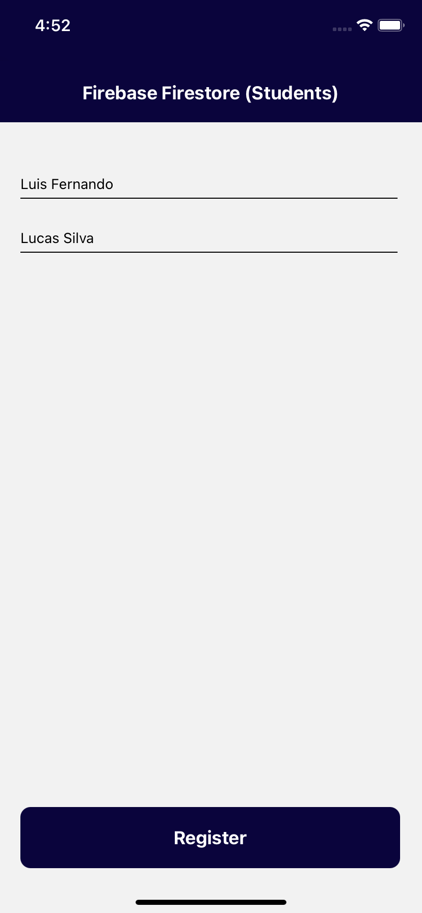

# Firebase Firestore (Students)
Submodule of repository <a href="https://github.com/LuisFernando1407/pidm">PIDM</a>

- Execution
  - <b>npm install</b>
  - After <b>npm run android</b> or <b>npm run ios</b>

- App preview

  
  

